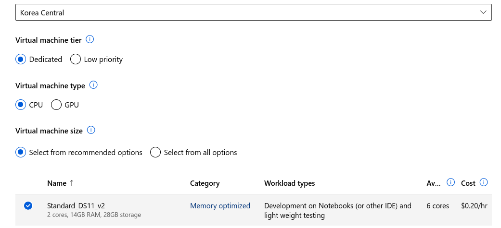

# Explore clustering with Azure Machine Learning Designer

[https://microsoftlearning.github.io/AI-900-AIFundamentals/instructions/02c-create-clustering-model.html](https://microsoftlearning.github.io/AI-900-AIFundamentals/instructions/02c-create-clustering-model.html)

1. Create a compute cluster

1. Create and configure a pipeline 

1. Create a dataset 
    1. create a dataset from web files 
    
    
    
    
    
    
    
    
    
    
    
2. Configure the canvas
    1. select columns → all except specie
    2. clean missing data —> all columns 
        1. 0 Minimum, 1 maximum. remove entire row 
    3. normalize data 
        1. MinMax
        2. all columns 

1. Submit

# Add training modules

1. Split data
    
    
2. train clustering_model 
    1. all columns
3. K-means clustering → 3 centroids
4. assign data to clusters
5. Evaluate model

# create inference pipeline

1. Create an inference pipeline 

# deploy

1. new real-time endpoint:
    1. 
    - **Name**: predict-penguin-clusters
    - **Description**: Cluster penguins.
    - **Compute type**: Azure Container Instance

test on the endpoint page

