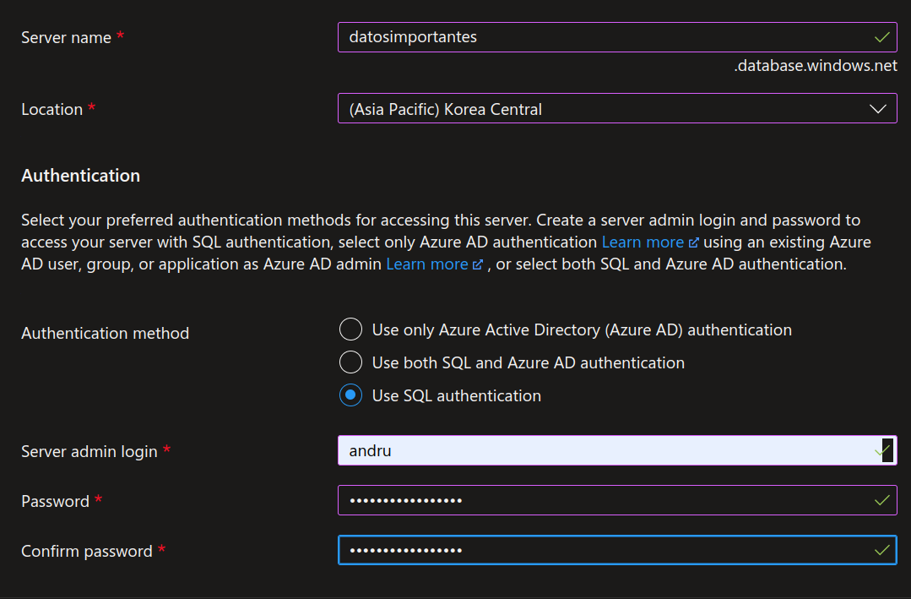

# SQL Databases, SQL inyection

# Crear Base de datos SQL

1. Primero necesitamos un servidor de SQL (Motor)

SQL Servers 




1. SQL Database 


Las bases de datos de Azure no te van a dejar pasar si no tienes la IP subida

Private endpoint y luego a la base de datos


### Habilitar la auditoria

1. Crear un logAnalytics Workspace


### Subir datos

1. Query editor (preview)


```html
INSERT INTO new_table(
	id,
	nombre,
	correo,
	tarjeta,
	direccion, 
	telefono
) VALUES(
	1,
	'Andru',
	'aleph87@innovaccion.mx',
	'1234561789541236',
	'Mi calle',
	454545

)
```

### Data discovery and classification


- Dynamic Data Masking


- Ledger

Todas las transacciones a los datos se van a guardar (todas las queries)

- activar cifrado de datos
- microsoft defender for cloud

**Valor predeterminado de enmascaramiento**


# SQL inyection

- sqlmap
    - Hace un mapeo de vulnerabilidades sql inyection

```bash
sqlmap -h #ayuda

sqlmap -u <URL> --tor 
```

**Sanitizar formularios PHP**