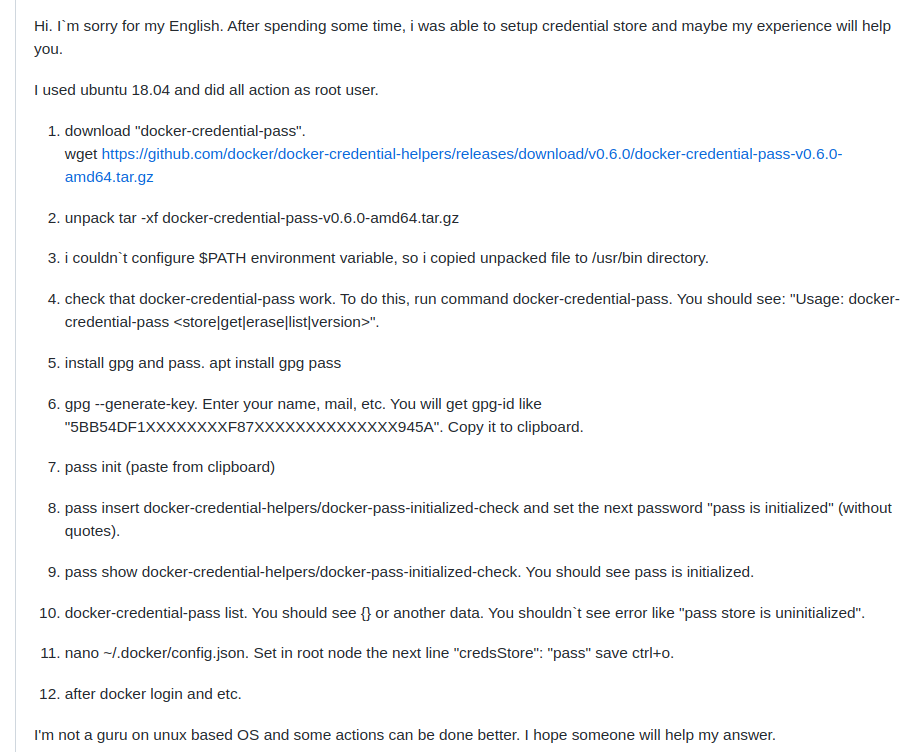

# ACR and Kubernetes

### Instalar y habilitar el inicio de sesión de docker desktop



1. Crear un contenedor → Container Instances
    1. 
    
    
    


FQDN what is this? → used to access the container

They are administrated with YAML


Every command of Azure has az has a prefix

### Subir una imagen de un contenedor

Puedes correr esto en la CLI de Azure o en la local

```jsx
// create acr
az acr create --resource-group containerPractice -n registryasds2 --sku Basic

// obtain the acr token
az acr login -n registryasds2 --expose-token

//login into the acr
docker login name_acr_server -u User -p token_access

docker login loginServer -u 00000000-0000-0000-0000-000000000000 -p accessToken 

```


```jsx
az acr repository list --name registryasds2 --output table
// list the images in the container
```

### Subir local image to azure

```jsx
//Primero tienes que hacer un tag
docker tag docker101tutorial:latest registryasds2.azurecr.io/docker101tutorial:latest

```


```jsx
//ahora si subes la image
docker push registryasds2.azurecr.io/docker101tutorial
```


```jsx
TOKEN=$(az acr login --name <acrName> --expose-token --output tsv --query accessToken)
```


In the part of repositories 

### Crear kubernete

```bash
#Desde tu terminal
sudo az aks install-cli
docker-compose up -d # construye una imagen 

az acr list -g resourcegroup --query "[].{acrLoginServer:loginServer}" --output table
az acr list -g acrepractice --query "[].{acrLoginServer:loginServer}" --output table
```


```bash
# los dos puntos son como para selecionar el tag
docker push registryasds2.azurecr.io/azure-vote-front:v1
```

### crear kubernete

```bash
az aks create -g resourcegroup -n myaks --node-count 2 --generate-ssh-keys --attach-acr acrname

```

```bash
az aks create -g acrepractice -n myaks --node-count 2 --generate-ssh-keys --attach-acr registryads2
e# el attatch es para enlazar el kubernete y el acr
```

```bash
az aks update -n myAKSCluster -g myResourceGroup --attach-acr <acr-name>
az aks update  -n myaks -g acrepractice --attach-acr registryasds2
```

Checar credenciales

```bash
az aks get-credentials -g acrepractice -n myaks
# para obtener credenciales
kubectl get nodes

```

